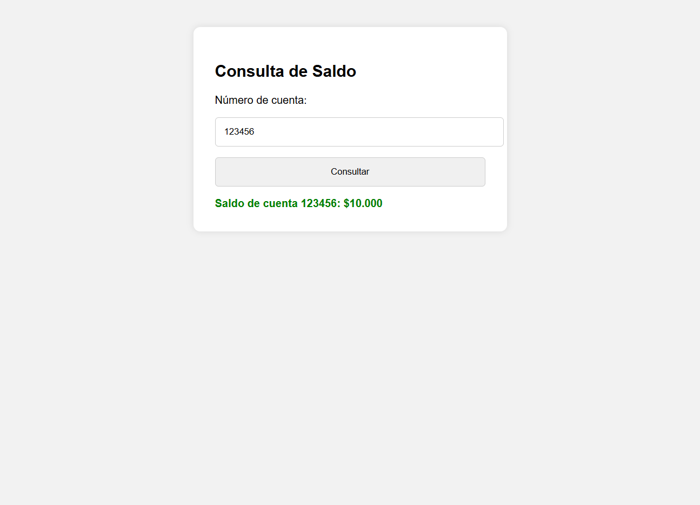
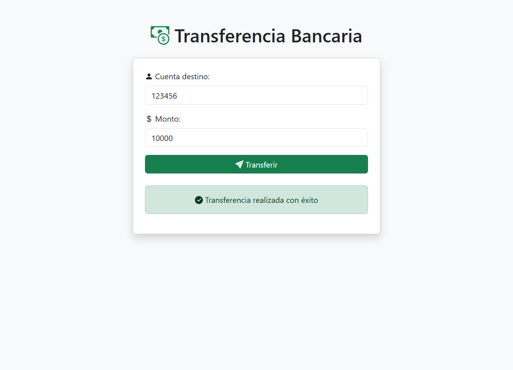

# Proyecto Automatización Transferencia Bancaria

## 🧪 Descripción
Este proyecto automatiza la prueba de una página web que simula:

💸 Transferencia bancaria: Se verifica que, al ingresar una cuenta válida y un monto mayor que cero, el sistema muestre correctamente un mensaje de confirmación.

💰 Consulta de saldo: Se valida que el saldo sea visible al ingresar una cuenta registrada.

---

## 🛠️ Tecnologías utilizadas
- Java 11+
- Selenium WebDriver
- JUnit 5
- Maven
- ChromeDriver

---
### Módulo 4 - Evaluación Modular

### Equipo 4: 
- Fabiola Díaz
- Felipe Lobos
- Eduardo Arellano
- Carlos Vasquez
---
📸 Evidencias

  
 
 
 

